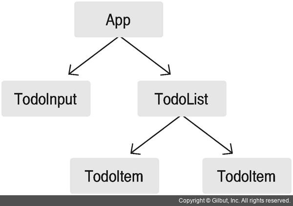
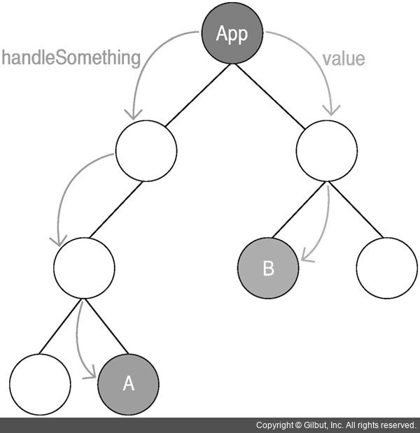
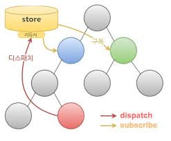

# 리덕스


> ### 리덕스란?

리액트에서 상태를 더 효율적으로 관리하는 데, 사용하는 상태 관리 라이브러리


> ### 쓰는이유?

예를들어, 일정관리 프로젝트 내에서 



App에서 모든 상태 로직을 관리 하기 때문에,

App 컴포넌트에 state를 업데이트를 하면 App 컴포넌트가 리렌더링 되고, 리액트 특성상 하위 컴포넌트도 모두 리렌더링 된다. 

따라서, 최적화작업이 필요한 이유 -> shouldComponentUpdate에서 구현 방지 적용




컴포넌트가 적을 시에는 문제가 별로 없지만, 점차 증대 할 경우, 

1. 불필요한 리렌더링이 일어남 -> 최적화 작업 ㅜㅜ
2. 여러 컴포넌트를 거쳐 props를 전달하는것은 너무 비효율적 
3. 부모에서 필요하지 않지만, 자식컴포넌트 때문에 필요한 props개수가 너무 많아질 가능성 높음
4. 상태관리 로직이 많아서, 컴포넌트 코드량이 증가 


> ### 리덕스 구조




리덕스는 상태 관리의 로직을 컴포넌트 밖에서 처리 

​	(필자 : 클라우드 서비스 같은 느낌 )

리덕스를 사용하게 되면 store라는 객체 내부에 상태를 담게 된다. 


스토어에 모든 상태관리가 일어난다. 

상태에 어떤 변화를 일으켜야 할때에는 Action -> store 전달

액체는 객체 형태 , 상태를 변화시킬때 이 객체를 참조하여 변화를 일으킨다. 


액션을 전달하는 과정은 dispatch

스토어가 액션을 받으면 리듀서가 전달받은 액션을 기반으로, 상태를 어떻게 변경 시캬야 할지 정함 

액션을 처리하면 새 상태를 스토어에 저장 


스토어 안에 있는 상태가 바뀌면, 스토어를 구독하고 있는 컴포넌트에 바로 전달

부모컴포넌트로 props를 전달하는 작업 생략하며, 리덕스에 연결하는 함수를 사용하여 컴포넌트를 스토어에 구독


- 스토어 : 어플리케이션의 상태 값들을 내장
- 액션 : 상태변하를 참조하는 객체
- 디스패치 : 액션을 스토어에 전달하는 것
- 리듀서 : 상태 변화시키는 로직이 있는 함수 
- 구독 : 스토어 값이 필요한 컴포넌트를 스토어를 구독


> ### 리덕스 사용

리액트에서 사용하는 라이브러리 이지만, 리액트에 의존하지 않음

즉, 리액트에서 사용하지 않아도 사용가능


# 액션

스토어에서 상태 변화를 일으킬 때, 참조하는 객체이다. 

반드시 type 값을 가져야 한다. 

```js
{
    type:"INCREMENT"
}
// type 값은 필수!!!
```


> ### JSbin_Example

```js
// 액션
const INCREMENT = "INCREMENT";
const DECREMENT = "DECREMENT";

// 액션 생성 함수
// 액션 객체를 생성하는 함수
// () => ({})  === function() { return{} }

const increment = () => ({
  type : INCREMENT
});

// argument가 있는 액션 생성 함수
// 유동적인 값이 필요한 경우
const increment = (diff) => ({
  type : INCREMENT,
  diff: diff
});

const decrement = (diff) => ({
  type : DECREMENT,
  diff: diff
});

console.log(increment(1));
console.log(increment(2));
```


# 리듀서

상태 변화를 일으키는 함수

파라미터가 2개 (현재상태, 액션 객체 )


> ### 하나의 값이 존재

```js
(...)
 
 const initialState = {
 	number : 0
 }

(...)

// 리듀서
// 상태 변화 로직이 있는 함수
// es6 문법으로 state값이 undefined이면, initialState를 기본값으로 가진다.
function counter(state = initialState, action){
  switch(action.type){
    case INCREMENT:
      return {
        ...state,
        number: state.number + action.diff
      };
    case DECREMENT:
      return {
        ...state,
        number : state.number - action.diff
      };
    default:
        return state;
  }
}
```


> ### 다중값 존재

```js
// state 초기화
const initialState = {
  number: 0,
  foo:'bar',
  baz:'quz'
};

// 리듀서
// 상태 변화 로직이 있는 함수
function counter(state = initialState, action){
  switch(action.type){
      
     case INCREMENT:
      return Object.assign({}, state, {
        number: state.number + action.diff
      })
      
    case DECREMENT:
      return Object.assign({}, state, {
        number: state.number - action.diff
      })
    default:
        return state;
  }
}

// 리듀서 함수 확인 
console.log(counter(undefined, increment(1)));

```


- Object.assgin : 여러 객체를 하나로 합쳐주는 내장메소드

  > ### object.assign Example

```js
var car = {
    weight: 3.5,
    color: 'red',
    speed: 50
}
 
var truckSpecific = {
    availableWeight: 25,
    registerYn: true
}
 
var superCarSpecific = {
    zeroToHundred: 3.4,
    convertable: false
}
 
var truckTarget = JSON.parse(JSON.stringify(car));
var superCarTarget = JSON.parse(JSON.stringify(car));
 
var truck = Object.assign(truckTarget, truckSpecific);
var superCar = Object.assign(superCarTarget, superCarSpecific);
 
console.log(truck);  
// {weight: 3.5, color: 'red', speed: 50, availableWeight: 25, registerYn: true}
console.log(superCar); 
// {weight: 3.5, color: 'red', speed: 50, zeroToHundred: 3.4, convertable: false }


```


> ### 객체 합치는 과정

```js
{ number : 2} => { number : 1, foo : 'bar', baz: 'quz'}	=> {} 
=== 
 {number : 2, foo : 'bar', baz: 'quz'}
```


리듀서 함수를 직접 실행하지는 않음, 리덕스가 리듀서를 직접 실행


# 리덕스 스토어 생성


```js
(...)
 
const {createStore} = Redux;
// CRA 에서 import {createStore} from 'Redux' 와 같다.

const store = createStore(counter);
```


# 구독

리덕스 스토어 상태가 변할 때마다, 특정 함수를 실행 

react-redux의 connect 함수가 대신


```js
(...)
 const unsubscribe = store.subscribe(() => {
    console.log(store.getState())
})

// subscribe : 스토어 구독시 함수 실행, 함수형태에 파라미터를 받는다.
// 스토어 상태에 변화가 일어날때 마다, 호출 
// subscribe가 호출되면, return 값으로 unsubscribe 함수를 반환 

```


# 디스패치

액션을 스토어에 전달하는 것

```js
store.dispatch(increment(1));
store.dispatch(decrement(5));
store.dispatch(increment(10));
```


# 정리

컴포넌트에 상태변화 발생 ->

 상태 감지 -> 

action -> dispatch -> reducer -> store -> subscribe

 ->

 컴포넌트 상태변화 반영


# 리덕스 3가지 규칙

> ### 1. 스토어는 단 1개

하나의 프로젝트에 스토어는 언제나 단 한개이다. 

스토어를 여러개 생성하는 건 권장하지 않음.

리듀서를 여러 개 만들어서 관리한는 것은 가능


> ### 2. state는 읽기 전용

리덕스의 state의 값은 읽기전용

절대로, 직접 수정하면 안됨

subscribe함수나 리렌더링이 제대로 되지 않을 가능성 높음

상태를 업데이트 시 새 상태 객체를 만들어서 넣어 주어야 한다. 


새 객체를 만든다고 성능이 저하되지 않음. 

Object.assgin()사용한다고 해서 이전에 사용된 객체들이 메모리에 누적되지 않음. 

상태 레퍼런스가 사라지면, 자동으로 메모리 관리


nested된 객체가 있을 때, 내부의 깊은 값 까지 복사하지 않음.

객체 내부의 키 레퍼런스만 복사하므로 객체가 복잡하다고 성능이 저하 되지 않음 


> ### 3. 스토어는 단 1개

모든 변화는 순수함수 로 이루어져야 한다. 

리듀서함수를 가르킨다. 

결과값을 출력할때는 파라미터 값에 의존,

같은 파라미터는 언제나 같은 값을 출력


# 참조


- 리액트를 다루는 기술 - 길벗 출판사 
- velopoer.com
- velog.io.velopert