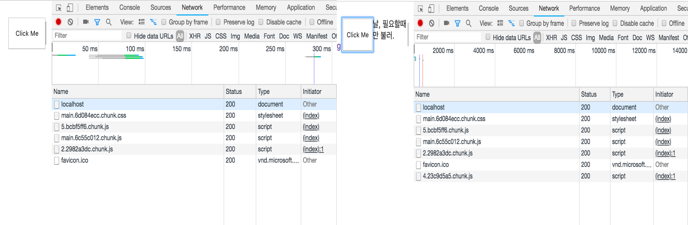

# Code Splitting

> Code Splitting 이란?

당장 쓰지 않는 코드들을 분리시켜두고 필요한 상황에 불러와 랜더링을 하는 방식을 말한다.

    import item from './components/Item'
    
    class Menu extends Component {
    state = {
      flag: false
    }
    
    itemhandler = () => {
      this.setState({
        flag: true
      })
    }
      render() {
        const { flag } = this.state
        return (
        	<Fragment>
     				<Button onClick={this.itemhandler}> Show Button </Button>   	
    	    	{ flag && <item /> }
        	</Fragment>
        )
      }
    }

위의 코드를 예를들어 보자,  메뉴 컴포넌트 children으로 item들이 있으며, Button이 클릭 된 후 flag state에 의해 디스플레이 여부를 판단한다. 일반적으로 초기 페이지를 랜더링할 때 모든 컴포넌트가 같이 랜더링 되므로 초기 로딩속도가 느려질 수 밖에 없는 구조이다. 평소에는 사용하지 않는 컴포넌트를 불러오지 않도록 분리시켜 놓고, 필요한 경우에 컴포넌트를 랜더링하여 불러오는 방식을 Code Splitting이라고 한다.

#### 그럼 이제 코드를 수정해보잣-!

    import item from './components/Item'
    
    class Menu extends Component {
    state = {
      item: null,
    }
    
    itemhandler = () => {
      import('./item').then(({default : item})) => {
        this.setState({
          item
        })
      })
    }
      render() {
        const { flag } = this.state
        return (
        	<Fragment>
     				<Button onClick={this.itemhandler}>Show Button</Button>
    	    	{ item && <item /> }
        	</Fragment>
        )
      }
    }

위 코드는 item state의 값 유무에 따라 컴포넌트의 디스플레이 여부를 판단한다.

null값을 가지는 item 객체를  state로 선언해두고 버튼 이벤트가 발생했을 때 동적으로 Component를 불러오며 불러온 컴포넌트를 통해 item의 state를 변경시켜주는 코드이다.

* import 함수는 webpack에서 제공하는 함수이며, 비듀.  import 함수를 이용하면 webpack에서 자동으로 chunk 형태로 번들링 해준다.

위와 같은 문법을 "dynamic import syntax" 라고 부른다.

Code Splitting을 하면 이렇게-! 이벤트가 발생했을 때 동적으로 4.23~~~.chunk.js 파일을 가져오는것을 확인 할 수 있습니다.

> 코드를 재활용 해보자! - HoC (Higher-order-component)

"쉽게말해 반복되는 코드를 재활용하자!"가 목표입니다. 코드를 작성하다 보면 수많은 컴포넌트들이 생기게되고 이 무수히 많은 컴포넌트들을 하나하나 스플릿팅 해야 한다고 생각해봅시다. 스플릿팅이 필요할 때 마다 하나하나 state를 만들어가면 작업하기에는 너무 귀찮ㅡ,.ㅡ ..

그래서 반복되는 코드를 재활용 하기 위해 리액트에서 사용하는 코드 패턴입니다.

Hoc 함수를 통해 특정 컴포넌트에게 반복되는 기능을 입혀주는 역할을 합니다

위의 코드를 바탕으로 컴포넌트를 스플릿팅할 때 반복되는 코드는 다음과 같습니다.

    // 1번!
    state = {
      Component,
    }
    
    // 2번!
    import('./item').then(({default : item})) => {
      this.setState({
        item
      })
    })
    
    // 3번!
    { Component && <Component />}

해당 코드를 매번 스플릿팅할 컴포넌트마다 작성해주는 것은 어지간히 비효율적인 일 입니다.  이런 반복적인 일을 해결해주는게 Hoc 패턴이죠! 음... 모듈화(?)라고 생각하시면 편할 것 같습니다.

Hoc의 기본 틀은 다음과 같습니다.

    import React, { Component } from 'react';
    
    const withSplitting = getComponent => {
      class WithSplitting extends Component {
        state = { 
          Splitted: null,
        }
      
        constructor(props) {
          super(props)
          getComponent().then(({default: Splitted}) => {
            this.setState({
              Splitted
            });
          });
        }
    
        render() {
          const {Splitted} = this.state
          if (!Splitted) {
            return null;
          }
          return <Splitted {...this.props} />
        }
      }
      return WithSplitting
    }
    
    export default withSplitting

우선, Hoc의 네이밍은 "with_____" 의 규칙을 따르게 됩니다.

withSplitting 함수는 getComponent를 인자로 받아옵니다. 이 getComponent의 정체는 위에서 말했던 "dynamic import syntax"를 말합니다. 네이밍 그대로 컴포넌트를 가져오는 함수인 ()=>import('.files')이 들어가게 되죠! getComponent를 통해 비동기적으로 컴포넌트를 불러오고 state에 넣어줍니다. 그 다음은 state를 불러와 랜더링 해주는 로직이 진행되죠.

최종적으로는 하나의 클래스를 가진 함수를 반환해주는 구조입니다. 그리고 클래스 안에서는 컴포넌트를 랜더링하는 과정이 이루어지게 되구요.

#### 그렇다면 위의 코드를 한번 더 수정해 봅시다.

    const item = withSplitting(() => import('./Item'))
    
    class Menu extends Component {
    state = {
      flag: false,
    }
    
    itemhandler = () => {
        this.setState({
          flag: true
        })
    }
      render() {
        const { flag } = this.state
        return (
        	<Fragment>
     				<Button onClick={this.itemhandler}>Show Button</Button>
    	    	{ flag && <item/> }
        	</Fragment>
        )
      }
    }

코드를 이렇게 수정하면  Hoc를 이용한 코드 스플릿팅까지 완성됩니다.
